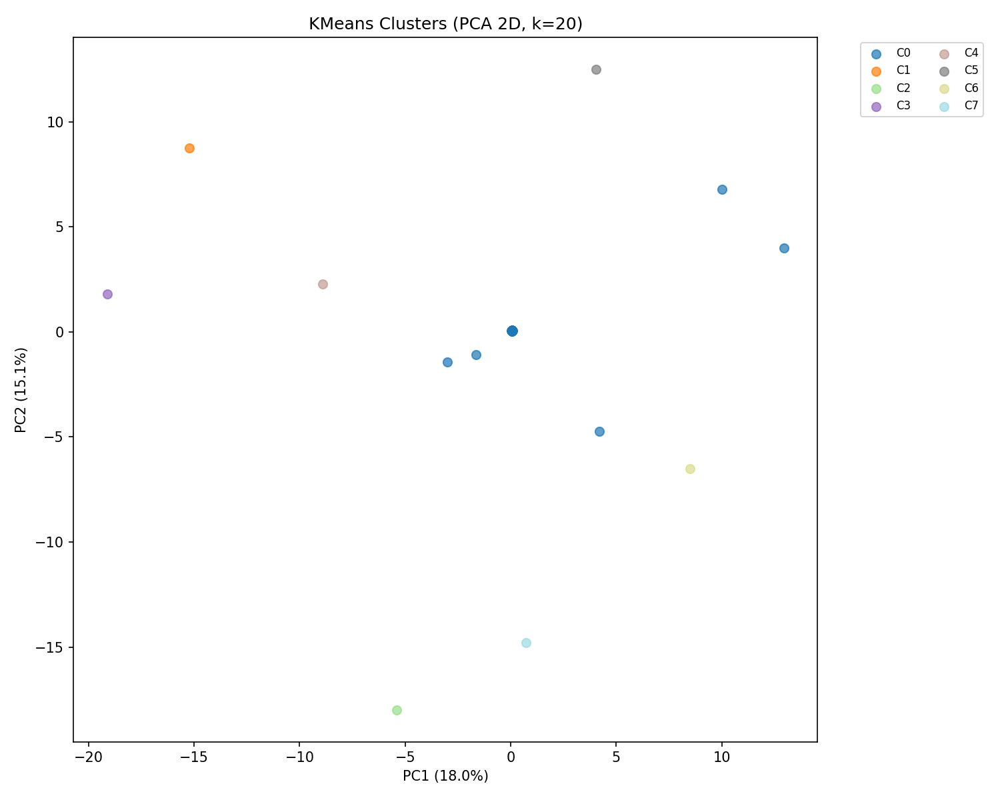

# IG Reels Data Augmentation

## 專案說明

這個專案的目標是對歷史 IG Reels 資料做 Data Augmentation，為每一篇舊 Reels 推估 Bass Diffusion Model 的四個參數（P、Q、M、constant），讓這些歷史資料可以作為訓練資料，之後用來預測新 KOL 貼文的觀看數。

## Bass Model 參數說明

| 參數 | 意義 |
|------|------|
| P（內生增長） | 自然流量，自動自發去看的人的比率 |
| Q（模仿效應） | 社交擴散力，因為看到別人看了而跟風的程度 |
| M（市場潛力） | 這篇 Reels 理論上趨近無限時會達到的最大觀看數 |
| constant | 初始觀看基數 |

## 資料來源

| 檔案 | 說明 |
|------|------|
| `bass_parameters_by_reel.csv` | 新資料，224 筆，已有真實 P/Q/M/constant |
| `hist_reels.csv` | 舊資料，10,487 筆，只有觀看數 |
| `reels_static_info.csv` | Reels 靜態資訊（duration 等） |
| `reels_embedding.csv` | 32 維文字 embedding + 62 個主題權重 |
| `ads_type_results.csv` | AI 業配判定結果 |

## Step 2：特徵工程（`step2_feature_engineering.ipynb`）

用 `reels_shortcode` 作為 key，拼出兩張特徵表：

- `new_features.csv`：223 筆（bass 224 筆 merge 後去除無效資料）
- `hist_features.csv`：10,373 筆

特徵包含：32 維 embedding、`best_topic_labels`、`duration`、`AI業配判定`。

**遇到的問題與解法：**

- `reels_embedding.csv` 有 174 欄、639,675 筆，直接讀取會 buffer overflow，改用 `engine='python'` + `on_bad_lines='skip'` 解決。
- `reels_embedding.csv` 沒有 `reels_shortcode` 欄位，改從 `Reels連結` URL 用 `str.extract(r'/reel/([^/]+)/')` 抽出 shortcode。
- `ads_type_results.csv` 的 key 欄位叫 `Reels代號` 而非 `reels_shortcode`，merge 前先 rename。

## Step 3：Augmentation（`step3_augmentation.ipynb`）

以 `new_features.csv` 的 223 筆做訓練（80% train / 20% test，random_state=42），對 `hist_features.csv` 的 10,373 筆推估 P/Q/M/constant。

**特徵前處理：**

- `best_topic_labels`：LabelEncoder 編碼（fit 在 train+test+hist 聯集，避免 unseen label）
- 缺值：以 train 中位數填補
- 標準化：StandardScaler（只在 train 上 fit，避免 leakage）
- 最終特徵維度：35（emb×32 + duration + AI業配判定 + best_topic_labels_enc）

**方法 A — KMeans Clustering（k=8）：**

用 train 的 35 維特徵做分群，每個 cluster 的 P/Q/M/constant 取平均，舊資料依照分到的 cluster 填入對應平均值。

**方法 B — KNN Similarity（K=5）：**

找 Euclidean 距離最近的 5 個訓練樣本，以距離倒數加權平均計算 P/Q/M/constant。

## 改動過程與原因

**改動 1 — 只用 embedding → 加入 duration、AI業配判定、best_topic_labels**

原本只用 32 維 embedding，但這樣忽略了影片長度、是否業配、內容主題這些對觀看行為很重要的資訊，所以加進來一起做標準化後使用。

**改動 2 — M 值出現 1e+25 的離譜數字 → 加入 log1p 轉換**

原始 M 值分佈極度不均，少數 outlier 把 cluster 平均值拉爆，導致預測出 1.676e+25 這種不合理的數字。改用 `log1p` 壓縮後再做分群和預測，輸出時用 `expm1` 轉回來，M 值恢復到幾萬到幾百萬的合理範圍。

**改動 3 — k=20 → k=8**

k=20 時 training data 只有 178 筆，平均每群只有 9 筆，PCA 圖上每個 cluster 只有一個點，分群太細導致泛化能力差。改成 k=8 後每群約 22 筆，cluster 間特徵變異數從 9 提升到 18～21，分群更有意義，且每個 cluster 都有清楚的主題（如食譜、飲料、台灣旅遊、營養與保健等）。

## 結果討論

| 方法 | RMSE 總和（log scale） |
|------|----------------------|
| KMeans（k=8） | 27.92 |
| KNN（K=5） | 28.85 |

自動選用 **KMeans**。

**特徵重要性：** 分群主要由 embedding 決定（emb_016、emb_004、emb_012 變異數最大），duration 和業配類型影響相對較小，代表文案的語意內容是決定這篇 Reels 擴散模式的最關鍵因素。

**最終輸出：** `augmented_hist.csv`，10,373 筆，欄位為 `reels_shortcode`、`p`、`q`、`M`、`constant`、`method_used`。



## 專案結構

```
data_augmentation/
├── data/
│   ├── raw/          # 原始資料
│   ├── processed/    # new_features.csv、hist_features.csv
│   └── output/       # augmented_hist.csv、kmeans_cluster_viz.png
├── notebooks/
│   ├── step2_feature_engineering.ipynb
│   └── step3_augmentation.ipynb
├── README.md
└── .gitignore
```
