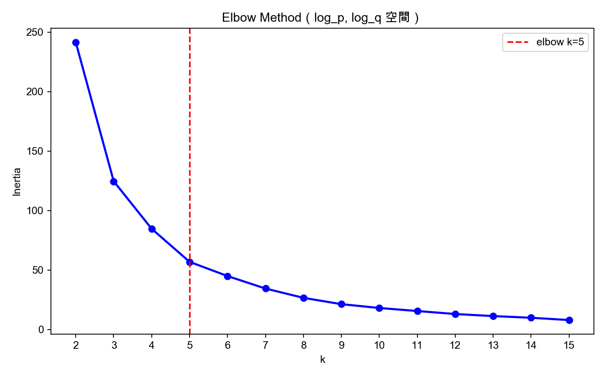

# IG Reels Data Augmentation

## 專案說明

這個專案的目標是對歷史 IG Reels 資料做 Data Augmentation，為每一篇舊 Reels 推估 Bass Diffusion Model 的四個參數（P、Q、M、constant），讓這些歷史資料可以作為訓練資料，之後用來預測新 KOL 貼文的觀看數。

## Bass Model 參數說明

| 參數 | 意義 |
|------|------|
| P（內生增長） | 自然流量，自動自發去看的人的比率 |
| Q（模仿效應） | 社交擴散力，因為看到別人看了而跟風的程度 |
| M（市場潛力） | 這篇 Reels 理論上趨近無限時會達到的最大觀看數 |
| constant | 初始觀看基數 |

## 資料來源

| 檔案 | 說明 |
|------|------|
| `bass_parameters_by_reel.csv` | 新資料，224 筆，已有真實 P/Q/M/constant |
| `hist_reels.csv` | 舊資料，10,487 筆，只有觀看數 |
| `reels_static_info.csv` | Reels 靜態資訊（duration 等） |
| `reels_embedding.csv` | 32 維文字 embedding + 62 個主題權重 |
| `ads_type_results.csv` | AI 業配判定結果 |

## Step 2：特徵工程（`step2_feature_engineering.ipynb`）

用 `reels_shortcode` 作為 key，拼出兩張特徵表：

- `new_features.csv`：223 筆（bass 224 筆 merge 後去除無效資料）
- `hist_features.csv`：10,373 筆

特徵包含：32 維 embedding、`best_topic_labels`、`duration`、`AI業配判定`。

**遇到的問題與解法：**

- `reels_embedding.csv` 有 174 欄、639,675 筆，直接讀取會 buffer overflow，改用 `engine='python'` + `on_bad_lines='skip'` 解決。
- `reels_embedding.csv` 沒有 `reels_shortcode` 欄位，改從 `Reels連結` URL 用 `str.extract(r'/reel/([^/]+)/')` 抽出 shortcode。
- `ads_type_results.csv` 的 key 欄位叫 `Reels代號` 而非 `reels_shortcode`，merge 前先 rename。

## Step 3：Augmentation（`step3_augmentation.ipynb`）

以 `new_features.csv` 的 224 筆做訓練，對 `hist_features.csv` 的 10,375 筆推估 P/Q/constant，M 直接取 `views`。

### 流程

**1. 資料準備**

- 對 `p_after4d`、`q_after4d`、`constant_after4d_time0_views` 取 `log1p` 壓縮極端值
- 候選特徵：`duration`、`best_topic_labels_enc`（LabelEncoder）、`AI業配判定`、`emb_new_000`～`emb_new_1023`（1024 維）
- 計算各特徵與 `log_p`/`log_q` 的相關係數，取 **top 5** 作為迴歸特徵
  - 實際選出：`emb_new_256`、`emb_new_095`、`duration`、`emb_new_067`、`emb_new_409`

**2. Elbow Method 找最佳 k（`data/output/elbow.png`）**

- 在 `(log_p, log_q)` 空間跑 KMeans，k 從 2 掃到 15
- 用 Kneedle 法自動偵測 elbow，得 **k = 5**

**3. KMeans 分群**

- 以 `(log_p, log_q)` 為分群依據，把 224 筆新資料分成 5 群
- 各群大小：69 / 46 / 59 / 12 / 38 筆

**4. Per-Cluster 線性迴歸**

- 80% train / 20% test（random_state=42，stratified by cluster）
- 對每個 cluster 分別用 top-5 特徵跑 `LinearRegression`，預測 `log_p`、`log_q`、`log_constant`

**5. 對舊資料預測**

- 先用全量迴歸（input features → log_p_est, log_q_est）為 hist_features 推估落點
- 再用 `KMeans.predict` 指派 cluster
- 代入對應 cluster 的線性迴歸公式，`expm1` 轉回原始尺度
- **M 直接取 `views` 欄位**（實際觀測值）

### 最終輸出

`augmented_hist.csv`，10,375 筆，欄位：`reels_shortcode`、`p`、`q`、`M`、`constant`、`cluster`



## 專案結構

```
data_augmentation/
├── data/
│   ├── raw/          # 原始資料
│   ├── processed/    # new_features.csv、hist_features.csv
│   └── output/       # augmented_hist.csv、kmeans_cluster_viz.png
├── notebooks/
│   ├── step2_feature_engineering.ipynb
│   └── step3_augmentation.ipynb
├── README.md
└── .gitignore
```
